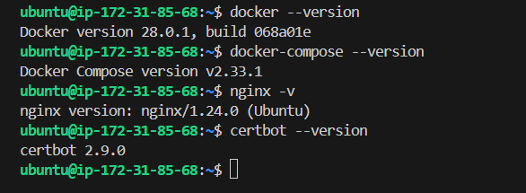

# Dynamic AWS EC2 Provisioning with Terraform and Ansible

Fully automated EC2 setup with EBS storage and a web server stack, integrated with Terraform and Ansible.

## Overview
- **Terraform**: Provisions an AWS EC2 instance with dynamic inputs (region, SSH key, instance name) and an EBS volume, then triggers Ansible automatically.
- **Ansible**: Configures Docker, Docker Compose, Nginx, and Certbot using an inventory file updated by Terraform.
- **Purpose**: End-to-end automation for rapid, scalable web server deployment.

## Tech Stack
- Terraform
- Ansible
- AWS (EC2, EBS)
- Docker, Docker Compose, Nginx, Certbot

## Features
- **Dynamic Inputs**: Customize region, key pair, and instance name at runtime.
- **EBS Storage**: Adds persistent volume to the EC2 instance.
- **Integrated Automation**: Terraform updates `hosts.ini` with the EC2 IP and runs Ansible—no manual steps.
- **Web-Ready**: Full stack for hosting apps with SSL support.

## Project Structure
├── ansible/      
│   ├── hosts.ini          
│   ├── install.yml        
│   └── configure.yml      
├── terraform/    
│   ├── main.tf         
│   ├── providers.tf       
│   ├── var.tf             
│   └── output.tf          
└── README.md

## Setup Instructions
1. **Dependencies**
   - **Terraform**: Version 1.0.0 or later
   - **Install**: [Official Terraform Installation Guide](https://learn.hashicorp.com/tutorials/terraform/install-cli)
   - **Ansible**: Version 2.9.0 or later
   - **Install**: [Official Ansible Installation Guide](https://docs.ansible.com/ansible/latest/installation_guide/intro_installation.html)
   - **AWS CLI**: Version 2.x
   - **Install**: [AWS CLI Installation Guide](https://docs.aws.amazon.com/cli/latest/userguide/install-cliv2.html)
   - **Configure**: Run `aws configure` with your AWS Access Key, Secret Key, and default region.
   - **SSH Key Pair**: An SSH key pair uploaded to AWS (e.g., `my-key.pem`)
   - **Generate**: `ssh-keygen -t rsa -b 4096 -f ~/.ssh/my-key`
   - **Upload**: Upload the public key to AWS EC2 Key Pairs in your desired region.
2. **Run**:
   - Navigate: `cd terraform`
   - Initialize: `terraform init`
   - Apply: `terraform apply` (prompts for `region`, `key_name`, `instance_name`)
3. **Verify**:
   - SSH in: `ssh -i ~/.ssh/my-key.pem ubuntu@<public-ip>`
   - Check:
     - `docker --version`
     - `nginx -v`
     - `certbot --version`

## Outcome
- Server setup from scratch to fully configured in one command.
- Streamlined automation reduces deployment time to minutes.

## Cleanup
- Destroy resources: `cd terraform && terraform destroy`

## Screenshots

---
Built by Vijay Anand M | [GitHub](https://github.com/VIJAY-ANAND-333) | [Email](mailto:vijayanandm333@gmail.com)