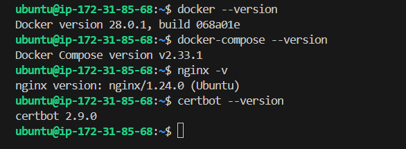

# Dynamic AWS EC2 Provisioning with Terraform and Ansible

Automated provisioning of an AWS EC2 instance with EBS storage and configuration of a web server stack.

## Overview
- **Terraform**: Provisions an EC2 instance with dynamic inputs (region, SSH key, instance name) and attaches an EBS volume for scalable storage.
- **Ansible**: Configures the server with Docker, Docker Compose, Nginx, and Certbot, ready for web app deployment.
- **Purpose**: Streamlines server setup for rapid, repeatable deployments.

## Tech Stack
- Terraform
- Ansible
- AWS (EC2, EBS)
- Docker, Docker Compose, Nginx, Certbot

## Features
- **Dynamic Inputs**: Customize region, key pair, and instance name at runtime.
- **EBS Integration**: Adds persistent storage to the EC2 instance.
- **Web-Ready**: Installs a complete stack for hosting applications with SSL support.

## Setup Instructions
1. **Terraform**:
   - Initialize: `terraform init`
   - Apply: `terraform apply` (prompts for region, key_name, instance_name)
   - Output: Public IP of the EC2 instance
2. **Ansible**:
   - Update `ansible/hosts.ini` with the EC2 IP.
   - Run: `ansible-playbook -i ansible/hosts.ini ansible/playbook.yml`
3. **Verify**: SSH into the instance and check:
   - `docker --version`
   - `nginx -v`
   - `certbot --version`

## Outcome
- Server setup time reduced from manual hours to minutes.
- Ready-to-deploy environment for web applications with SSL capability.

## Screenshots

---
Built by Vijay Anand M | [GitHub](https://github.com/VIJAY-ANAND-333) | [Email](mailto:vijayanandm333@gmail.com)
